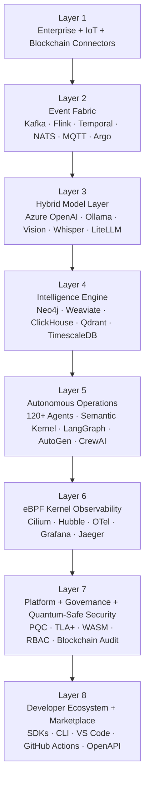
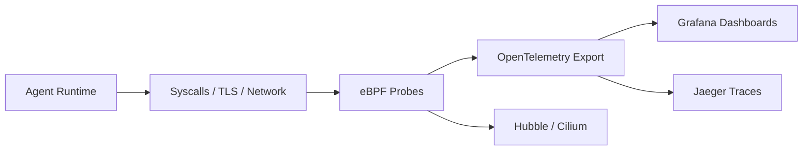
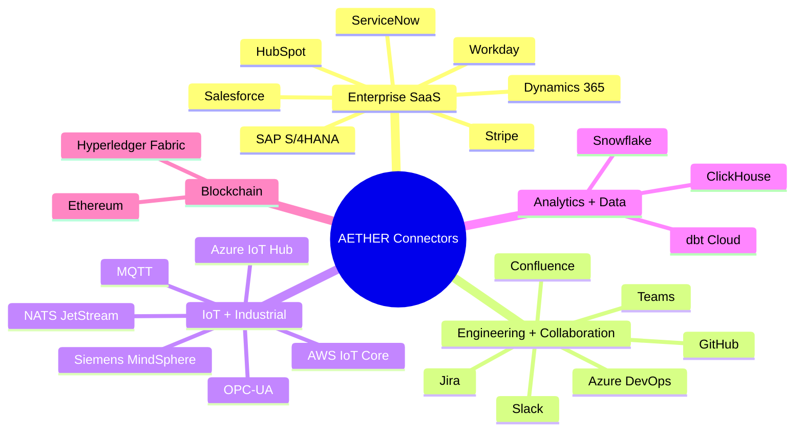
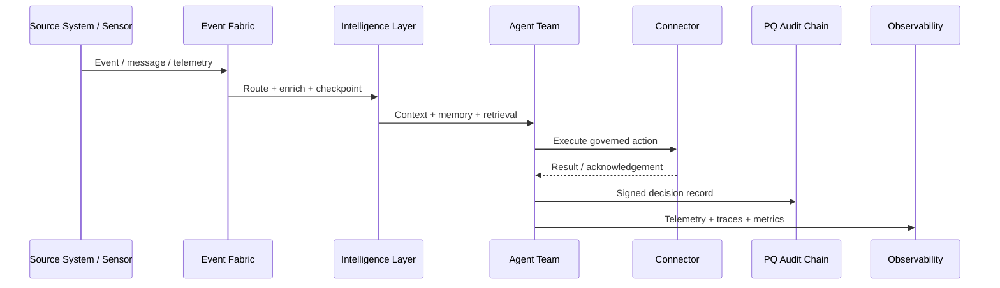
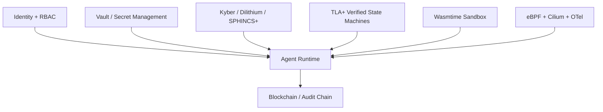
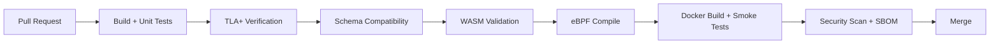

# AETHER
## Autonomous Enterprise Hyper-Intelligence Fabric

[](#cicd--quality-gates)
[](#license)
[](#technology-foundation)
[](#technology-foundation)
[](#technology-foundation)
[](#webassembly-sandboxing)
[](#post-quantum-cryptography)
[](#ebpf-kernel-observability)
[](#developer-experience)
[](#quick-start)

> **AETHER** is an open-source enterprise AI fabric for building autonomous, formally verified, multi-agent systems across enterprise SaaS, industrial IoT, and cloud-native environments.
>
> It combines **120+ specialised agents**, **25+ enterprise and IoT connectors**, **post-quantum security**, **WebAssembly sandboxing**, **eBPF kernel observability**, **federated learning**, **multi-modal intelligence**, and **schema-first event-driven architecture** into a single platform for senior engineering teams.

---

## Table of Contents

- [Why AETHER](#why-aether)
- [Vision](#vision)
- [Architecture Overview](#architecture-overview)
- [8-Layer Architecture](#8-layer-architecture)
- [Core Features](#core-features)
  - [Post-Quantum Cryptography](#post-quantum-cryptography)
  - [WebAssembly Sandboxing](#webassembly-sandboxing)
  - [eBPF Kernel Observability](#ebpf-kernel-observability)
  - [Formal Verification](#formal-verification)
  - [Federated Learning](#federated-learning)
  - [Multi-Modal Intelligence](#multi-modal-intelligence)
- [Enterprise Connectors](#enterprise-connectors)
- [Architecture Visuals](#architecture-visuals)
- [Repository Layout](#repository-layout)
- [Quick Start](#quick-start)
- [Developer Experience](#developer-experience)
- [CI/CD & Quality Gates](#cicd--quality-gates)
- [Contribution Guidelines](#contribution-guidelines)
- [Roadmap](#roadmap)
- [Security](#security)
- [License](#license)

---

## Why AETHER

Enterprise software does not fail because of a lack of APIs. It fails because critical business workflows span **multiple systems, conflicting data models, independent failure domains, and weak trust boundaries**.

AETHER is designed for teams that need more than orchestration:

- **Reasoning across systems** rather than invoking a single API.
- **Stateful, auditable autonomy** rather than stateless prompts.
- **Cryptographic integrity** rather than soft trust assumptions.
- **Kernel-level visibility** rather than opaque LLM black boxes.
- **Extensibility with isolation** rather than plugin risk.
- **Formal correctness** for critical paths rather than “best effort” automation.

---

## Vision

AETHER is a programmable autonomy fabric for the enterprise.

It is built to unify:

- ERP, CRM, HR, ITSM, collaboration, analytics, and engineering systems.
- Industrial protocols such as **OPC-UA**, MQTT, and IoT event streams.
- Multi-agent reasoning across structured data, documents, images, and audio.
- Security, governance, and observability requirements expected in regulated environments.

The result is an architecture where autonomous agents can:

1. Observe events from many systems.
2. Build context using graphs, retrieval, analytics, and memory.
3. Decide through governed reasoning flows.
4. Execute actions through enterprise connectors.
5. Record auditable decisions.
6. Improve over time through DSPy optimisation and federated learning.

---

## Architecture Overview



---

## 8-Layer Architecture

### Layer 1 — Enterprise, IoT, and Blockchain Connectors
AETHER integrates with enterprise systems, industrial protocols, and blockchain platforms through a connector model designed for schema-first, forward-compatible interoperability.

**Representative systems**
- SAP S/4HANA
- Salesforce
- ServiceNow
- Dynamics 365
- Workday
- HubSpot
- Stripe
- Azure IoT Hub
- AWS IoT Core
- OPC-UA
- Hyperledger Fabric
- Ethereum
- Jira / Confluence
- Slack / Microsoft Teams
- GitHub / Azure DevOps
- Snowflake / dbt Cloud

### Layer 2 — Event Fabric
AETHER uses event streaming and durable workflow orchestration to convert disconnected integrations into a coherent operational fabric.

**Core components**
- Apache Kafka
- Apache Flink CEP
- Temporal
- NATS JetStream
- Eclipse Mosquitto (MQTT)
- Argo Workflows

### Layer 3 — Hybrid Model Layer
AETHER routes workloads to the right model based on latency, cost, and data sensitivity.

**Model strategy**
- Azure OpenAI GPT-4o for orchestrator and director agents
- GPT-4o-mini for high-volume worker agents
- Llama 3.1 via Ollama for on-prem and sensitive data workloads
- Whisper for audio intelligence
- GPT-4o Vision for visual inspection and document interpretation
- LiteLLM as the routing gateway
- DSPy for prompt compilation and optimisation

### Layer 4 — Intelligence Engine
This layer provides retrieval, graph reasoning, analytics, semantic caching, and historical replay.

**Core services**
- Neo4j knowledge graph
- Weaviate hybrid BM25 + vector retrieval
- ClickHouse OLAP
- TimescaleDB time-series
- Qdrant semantic cache
- Iceberg + MinIO lakehouse
- Redis working memory
- Supabase / pgvector relational memory

### Layer 5 — Autonomous Operations
AETHER organises agent execution into specialised teams with domain boundaries, memory, tools, and governance.

**Execution frameworks**
- Semantic Kernel for C# enterprise write operations
- LangGraph for stateful flows and checkpointing
- AutoGen for multi-agent team conversations
- CrewAI for role-based crews
- DSPy for self-optimising prompts
- LlamaIndex for document intelligence

### Layer 6 — eBPF Kernel Observability
Every critical runtime can be observed at the kernel layer with minimal overhead and no invasive application instrumentation.

### Layer 7 — Platform, Governance, and Quantum-Safe Security
Security and control are embedded into the platform itself, not layered on later.

### Layer 8 — Developer Ecosystem and Marketplace
AETHER is designed to be built on, extended, and operationalised through SDKs, CI integrations, OpenAPI contracts, and isolated community WASM agents.

---

## Core Features

### Post-Quantum Cryptography

AETHER treats post-quantum cryptography as a first-class platform primitive.

**Implemented primitives**
- **CRYSTALS-Kyber-1024** for key encapsulation
- **CRYSTALS-Dilithium-5** for digital signatures
- **SPHINCS+** for stateless backup signatures
- **liboqs** as the underlying open quantum-safe cryptographic foundation

**What this enables**
- Quantum-safe agent-to-agent communication
- Cryptographically signed agent decisions
- Post-quantum signed audit records
- Tenant-verifiable trust and execution provenance

```text
Decision Record -> Canonical JSON -> Dilithium-5 Signature -> Chain Hash -> Hyperledger Fabric
```

### WebAssembly Sandboxing

AETHER isolates community and tenant agents in **Wasmtime** sandboxes using **WASI capability boundaries**, **memory ceilings**, and **fuel-metered execution budgets**.

**Security model**
1. Verify publisher signature.
2. Load module into a constrained Wasmtime runtime.
3. Expose only explicitly permitted host capabilities.
4. Meter CPU usage and bound memory.
5. Emit structured telemetry and execution trace data.

**Why it matters**
- Safe third-party extension model
- Tenant-safe execution for custom logic
- Deterministic runtime isolation
- Minimal attack surface compared to arbitrary plugin execution

### eBPF Kernel Observability

AETHER includes a dedicated **eBPF observability layer** to trace agent behaviour at the syscall and network boundaries.

**Observability goals**
- Trace agent execution without source-code modification
- Measure latency and kernel-level timings
- Correlate network calls to tenant and agent identity
- Export telemetry to OpenTelemetry / Grafana / Jaeger
- Support operational diagnostics for multi-agent workloads at scale



### Formal Verification

Critical workflow correctness is enforced with **TLA+**. Incident workflows, compliance flows, and saga compensation state machines are model-checked in CI to detect deadlocks, invariant violations, and unsafe termination states before merge.

### Federated Learning

AETHER supports federated learning using **Flower**, enabling cross-tenant model improvement while keeping raw data local to each participant.

### Multi-Modal Intelligence

AETHER fuses image, audio, document, graph, and structured enterprise data into a unified reasoning pipeline.

**Example modalities**
- CCTV and visual inspection
- Factory audio anomaly detection
- Contract and invoice extraction
- Time-series and event analytics
- Cross-system causal reasoning

---

## Enterprise Connectors

AETHER’s connector layer is intentionally broad so autonomous workflows can span business systems, collaboration surfaces, and industrial telemetry.



---

## Architecture Visuals

### Runtime Execution Path



### Security & Control Plane



---

## Repository Layout

```text
aether-hyperintelligence/
├── src/
│   ├── Aether.Core/              # kernel factory, plugin registry, WASM runner
│   ├── Aether.Agents/            # agent implementations and connector plugins
│   ├── Aether.API/               # REST + WebSocket + GraphQL + SSE
│   ├── Aether.Crypto/            # PQ crypto and audit primitives
│   ├── Aether.Models/            # contracts, schemas, protobuf, OpenAPI
│   ├── Aether.Tests.Unit/
│   ├── Aether.Tests.Integration/
│   └── langgraph/
│       ├── flows/
│       ├── agents/
│       ├── dspy/
│       ├── federated/
│       ├── multimodal/
│       └── intelligence/
├── event-streaming/
├── formal-verification/
├── wasm-agents/
├── federated-learning/
├── crypto/
├── ebpf/
├── knowledge-graph/
├── infrastructure/
├── sdk/
├── dashboard/src/
├── docs/
└── scripts/
```

---

## Quick Start

### Prerequisites

- Docker + Docker Compose
- Python 3.11+
- .NET 8 SDK
- Git
- Optional: local Ollama runtime for on-prem model routing

### 1. Clone the repository

```bash
git clone https://github.com/SubhasisNanda/aether-hyperintelligence.git
cd aether-hyperintelligence
```

### 2. Configure environment

```bash
cp .env.example .env
```

Populate `.env` using the credential guide in `docs/setup.md`.

### 3. Start the local platform

```bash
docker-compose -f infrastructure/docker/docker-compose.yml up -d
```

### 4. Validate the local baseline

```bash
python scripts/validate_local.py
```

### 5. Run the offline demo

```bash
python3 scripts/demo_offline.py
```

### Current validation surface

- .NET solution restore succeeds from the repository root
- .NET solution builds cleanly with warnings treated as errors
- .NET unit and integration test projects pass locally
- Python SDK installs in editable mode and passes compile checks plus unittest discovery
- TLA+ model checking and eBPF compilation remain covered by dedicated GitHub Actions workflows

---

## Developer Experience

AETHER exposes a development surface oriented around production engineering workflows.

### SDKs
- Python
- JavaScript / TypeScript
- .NET
- Go
- Rust

### Interfaces
- REST API
- WebSocket API
- GraphQL API
- Server-Sent Events
- OpenAPI 3.1 contract
- CLI and GitHub Actions

### Example: Python SDK

```python
from aether_sdk import AetherClient

async def main():
    async with AetherClient(api_key="aeth_live_xxx", tenant="acme") as client:
        result = await client.intelligence.query(
            "Which of our top customers are at churn risk this quarter?",
            systems=["Salesforce", "Stripe", "ServiceNow", "Dynamics"],
            explain=True,
        )
        print(result)
```

---

## CI/CD & Quality Gates

AETHER is built for high-signal engineering workflows with multiple quality gates.

**Current pipeline jobs**
- `ci` for warning-as-error .NET build, .NET tests, and Python SDK validation
- `tla-plus-verify` for model checking critical workflow specifications
- `ebpf-compile` for metadata-only eBPF compilation on Linux
- `dspy-nightly-optimiser` for secret-backed DSPy optimisation runs



---

## Contribution Guidelines

We welcome contributions from engineers working in enterprise integration, distributed systems, AI orchestration, platform engineering, and security.

### Before you contribute

1. Read the architecture overview and ADRs in `docs/`.
2. Search existing issues and proposals.
3. Open an issue for significant feature work before implementing.
4. Prefer small, reviewable pull requests.

### Development principles

All contributions must respect AETHER’s core engineering principles:

- Critical flows must remain **formally specifiable**.
- New connectors must be **schema-first** and **forward-compatible**.
- Runtime extensions must preserve **WASM isolation** and least privilege.
- Security-sensitive paths must preserve **post-quantum signing/encryption assumptions**.
- New telemetry surfaces should integrate with **OpenTelemetry** and existing observability patterns.
- Public APIs should be **documented and versioned**.

### Pull request checklist

- [ ] Unit tests added or updated
- [ ] Integration tests added where applicable
- [ ] TLA+ spec updated for critical state changes
- [ ] Schemas validated for compatibility
- [ ] WASM capability manifest reviewed (if applicable)
- [ ] Security implications documented
- [ ] Docs and examples updated

### Commit style

Use clear, descriptive commits. Conventional Commits are recommended:

```text
feat(connectors): add ServiceNow incident enrichment plugin
fix(wasm): enforce capability manifest memory limit
chore(ci): add TLA+ workflow cache
```

### Areas where contributions are especially valuable

- Additional enterprise connectors
- WASM reference agents
- TLA+ specifications for critical flows
- eBPF diagnostics and exporters
- SDK ergonomics and examples
- Documentation and architecture decision records

---

## Roadmap

### Near-term priorities
- AETHER core runtime and kernel
- Event schemas and workflow backbone
- Post-quantum crypto module
- TLA+ verification pipeline
- Connector baseline for enterprise and IoT systems

### Platform expansion
- 120+ agents across 12 teams
- Full WASM marketplace model
- Federated learning across tenant nodes
- Multi-tenant API and public SDKs
- VS Code extension and GitHub Actions ecosystem

### Long-term goals
- Richer autonomous remediation playbooks
- Broader industrial connector support
- Stronger policy-as-code for runtime governance
- Expanded reference architectures and production deployment blueprints

---

## Security

Security issues should be reported responsibly.

### Security posture highlights
- Post-quantum primitives for cryptographic trust
- Zero-trust-friendly platform boundaries
- WASM sandboxing for untrusted extensions
- eBPF-based observability for runtime transparency
- Blockchain-backed audit records for high-integrity decision trails
- CI-integrated security scanning and SBOM generation

> **Do not open public issues for undisclosed vulnerabilities.** Use the project’s private security contact process once published.

---

## Technology Foundation

AETHER intentionally spans multiple runtimes and specialised systems technologies:

- **.NET 8** for core runtime, API, connectors, and cryptography integration
- **Python** for LangGraph flows, DSPy optimisation, federated learning, and multimodal orchestration
- **Rust / Wasmtime** for WebAssembly SDKs and secure plugin execution
- **Go / eBPF userspace tooling** for low-level observability components
- **Kubernetes (k3s)** and Docker for deployment and local development

---

## License

This project is intended to be released under the **Apache License 2.0**.

```text
Copyright (c) Subhasis Nanda
Licensed under the Apache License, Version 2.0
```

---

## Final Note

AETHER is engineered for teams building enterprise AI systems that must be **autonomous, secure, observable, extensible, and correct**.

If you care about:
- multi-agent enterprise execution,
- formal correctness,
- post-quantum trust,
- sandboxed extensibility,
- and operational transparency,

then AETHER is built for you.
